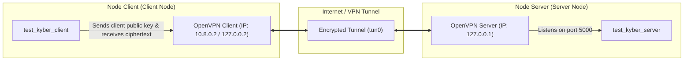

# Kyber (Research Fork)

This repository is a fork of the upstream Kyber implementation (pq-crystals/kyber), customized for post-quantum cryptography (PQC) research and benchmarking. Kyber is standardized as [FIPS 203](https://csrc.nist.gov/pubs/fips/203/final) (ML-KEM).

It contains:
- `ref/`: portable reference C implementation (clean, not platform-optimized)
- `avx2/`: optimized x86_64 implementation using AVX2/BMI2/POPCNT
- `ref/test/`: Kyber TCP client/server demo + stress tool (POSIX/WSL)

For a list of changes in this fork, see [CHANGELOG.md](CHANGELOG.md).

---

## Table of Contents

- [Reproducibility Quick Start](#reproducibility-quick-start)
- [Build](#build)
- [Executable Files \& Their Functions](#executable-files--their-functions)
- [Correctness Tests](#correctness-tests)
- [Benchmarking (Cycle Counts)](#benchmarking-cycle-counts)
- [Deterministic Test Vectors](#deterministic-test-vectors)
- [NIST KAT Generator (Optional)](#nist-kat-generator-optional)
- [TCP Client/Server Demo \& OpenVPN Network Setup](#tcp-clientserver-demo--openvpn-network-setup)
- [Coverage (Optional)](#coverage-optional)
- [License](#license)

---

## Reproducibility Quick Start

### Platform Notes

- **Linux is recommended** for reproducible benchmarking.
- **macOS** builds the `ref/` implementation fine in most setups.
- **Windows**: Use **WSL2** for the simplest build/run workflow (the stress tool under `ref/test/` uses POSIX APIs such as `fork()`).
- `avx2/` requires an x86_64 CPU with **AVX2** instructions.

### Dependencies

Ubuntu/Debian:

```sh
sudo apt-get update
sudo apt-get install -y build-essential make pkg-config libssl-dev
```

Optional tools:

```sh
sudo apt-get install -y valgrind lcov
```

macOS (OpenSSL headers/libs may require flags):

```sh
brew install openssl
export CFLAGS="-I$(brew --prefix openssl)/include"
export NISTFLAGS="-I$(brew --prefix openssl)/include"
export LDFLAGS="-L$(brew --prefix openssl)/lib"
```

---

## Build

All commands below assume you are at the repository root.

### Reference Implementation (`ref/`)

Build correctness tests:

```sh
make -C ref clean
make -C ref
```

This produces:
- `ref/test/test_kyber512`
- `ref/test/test_kyber768`
- `ref/test/test_kyber1024`

### AVX2 Implementation (`avx2/`)

Requires an x86_64 CPU with AVX2.

```sh
make -C avx2 clean
make -C avx2
```

This produces:
- Correctness: `avx2/test/test_kyber512`, `avx2/test/test_kyber768`, `avx2/test/test_kyber1024`
- Test vectors: `avx2/test/test_vectors512`, `avx2/test/test_vectors768`, `avx2/test/test_vectors1024`
- Speed benchmarks: `avx2/test/test_speed512`, `avx2/test/test_speed768`, `avx2/test/test_speed1024`

### TCP Client/Server \& Keygen (Under `ref/test/`)

To compile the TCP key encapsulation (KEM) network binaries and stress testing tools:

```sh
make -C ref/test clean
make -C ref/test all
```

This compiles all files for security modes 2, 3, and 4:
- Key generation: `test_kyber_keygen2`, `test_kyber_keygen3`, `test_kyber_keygen4`
- TCP Server: `test_kyber_server2`, `test_kyber_server3`, `test_kyber_server4`
- TCP Client: `test_kyber_client2`, `test_kyber_client3`, `test_kyber_client4`
- Stress testing: `test_kyber_stress2`, `test_kyber_stress3`, `test_kyber_stress4`

---

## Executable Files \& Their Functions

This section guides you through the roles and functionalities of all compiled executable binaries in the project:

### 1. TCP challenge-response Network Binaries (`ref/test/`)

| Executable | Purpose \& Detailed Behavior |
| :--- | :--- |
| `test_kyber_keygen{2,3,4}` | **Keypair Generator**: Generates client and server key pairs for security levels 2 (Kyber512), 3 (Kyber768), or 4 (Kyber1024). Saves them to four binary files in the working directory:<br>- `client_pk.bin` (Client's public key).<br>- `client_sk.bin` (Client's secret key).<br>- `server_pk.bin` (Server's public key).<br>- `server_sk.bin` (Server's secret key). |
| `test_kyber_server{2,3,4}` | **TCP Verification Server**: Listens on TCP port `5000` (by default) for connections.<br>- On startup, it loads the keys `client_pk.bin` and `server_sk.bin` (to verify directory assets).<br>- When a client connects, it receives the client's public key, runs encapsulation (`crypto_kem_enc`), and sends back the resulting ciphertext.<br>- It receives the decapsulated shared secret from the client, compares it against the local shared secret, and replies with a 1-byte verification result (0 for match, 1 for mismatch). Logs are written to `server_kyber.log`. |
| `test_kyber_client{2,3,4}` | **TCP Decapsulation Client**: Connects to the server's IP address on port `5000` (default target IP is `127.0.0.1`).<br>- On startup, it loads the keys `client_pk.bin`, `client_sk.bin`, and `server_pk.bin`.<br>- Transmits the client's public key to the server, then receives the ciphertext returned by the server.<br>- Decapsulates the ciphertext using the client's secret key to recover the shared secret, transmits the secret to the server, and receives the verification result. Logs are written to `client_kyber.log`. |
| `test_kyber_stress{2,3,4}` | **Load \& Stress Testing Tool**: Spawns multiple concurrent client sessions using POSIX `fork()` to query the server simultaneously. By default, it connects to `127.0.0.1` with 10 concurrent sessions.<br>- Tests server concurrency, stability under load, and monitors memory/CPU overhead.<br>- Configurable via environment variables: `TARGET_IP`, `CONCURRENT_SESSIONS` (number of processes), `BATCHES` (number of runs), and `BATCH_DELAY_SEC` (delay between batches). |

### 2. Local Algorithm Testing Binaries

| Executable | Location | Description |
| :--- | :--- | :--- |
| `test_kyber{512,768,1024}` | `ref/test/` or `avx2/test/` | **Correctness Test**: Verifies the basic logic of the Kyber KEM algorithm locally (Keygen -> Encapsulation -> Decapsulation) in memory. It serves as a sanity check to verify compilation without requiring a network. |
| `test_speed{512,768,1024}` | `ref/test/` or `avx2/test/` | **Speed Benchmarking**: Executes key operations (Keygen, Enc, Dec) in a loop (1000 iterations) and prints average and median CPU cycle counts utilizing `RDTSC`. |
| `test_vectors{512,768,1024}` | `ref/test/` or `avx2/test/` | **Deterministic Vector Generator**: Produces 10,000 sets of deterministic test vectors utilizing SHAKE128 as a pseudo-random seed generator. |
| `test_mul` | `ref/test/` or `avx2/test/` | **Polynomial Multiplication Benchmark**: Measures performance and correctness of NTT (Number Theoretic Transform) polynomial operations. |

---

## Correctness Tests

Verify implementation correctness locally:

Reference (`ref`):

```sh
./ref/test/test_kyber512
./ref/test/test_kyber768
./ref/test/test_kyber1024
```

AVX2:

```sh
./avx2/test/test_kyber512
./avx2/test/test_kyber768
./avx2/test/test_kyber1024
```

---

## Benchmarking (Cycle Counts)

The `test_speed*` programs print median and average CPU cycle counts (1000 iterations) using `RDTSC`.

Reference:

```sh
make -C ref speed
./ref/test/test_speed512
./ref/test/test_speed768
./ref/test/test_speed1024
```

AVX2:

```sh
make -C avx2 speed
./avx2/test/test_speed512
./avx2/test/test_speed768
./avx2/test/test_speed1024
```

---

## Deterministic Test Vectors

Generate deterministic vectors:

```sh
# Compile vectors (not built by default in ref)
make -C ref test/test_vectors512 test/test_vectors768 test/test_vectors1024

# Generate vector files
./ref/test/test_vectors512 > tvecs512.txt
./ref/test/test_vectors768 > tvecs768.txt
./ref/test/test_vectors1024 > tvecs1024.txt
```

---

## NIST KAT Generator (Optional)

Requires OpenSSL:

```sh
make -C ref nistkat
./ref/nistkat/PQCgenKAT_kem512
./ref/nistkat/PQCgenKAT_kem768
./ref/nistkat/PQCgenKAT_kem1024
```

Pre-generated KAT files are stored under `Kyber_KAT/`.

---

## TCP Client/Server Demo \& OpenVPN Network Setup

This guide walks you through setting up, connecting, and running a remote key encapsulation session between a **Node Server** and a **Node Client** on different networks using **OpenVPN** to bridge the connection securely.

### Network Topology



### Step 1: Set Up OpenVPN Between the Nodes

If the nodes reside on different networks or behind strict NAT firewalls, use OpenVPN to map them into a shared Virtual Private Network (VPN). To use the default server IP of the codebase:

1. **On the Server Node (hosting the Server App)**:
   - Install and configure an OpenVPN server.
   - Configure OpenVPN to use IP routing (**TUN** mode).
   - Configure your OpenVPN server or local routing so the Server Node's virtual VPN interface gets assigned the IP **`127.0.0.1`** (the codebase's default target IP).
   - Ensure the server firewall allows incoming connections on port `5000` (for the TCP demo) and port `1194` (for OpenVPN).
   - Export a client configuration profile (e.g., `client1.ovpn`).

2. **On the Client Node (hosting the Client App)**:
   - Install the OpenVPN client package (`openvpn` or OpenVPN Connect).
   - Copy the `client1.ovpn` file from the Server Node onto the Client Node.
   - Establish the VPN tunnel:
     ```sh
     sudo openvpn --config client1.ovpn
     ```

3. **Verify Connectivity**:
   - Check that you can ping the Server Node from the Client Node: `ping 127.0.0.1`.

---

### Step 2: Build Network Binaries on Both Nodes

On both the Server and Client nodes, compile the network binaries under the test directory:

```sh
# Clean and compile client, server, stress, and keygen binaries
make -C ref/test clean
make -C ref/test all
```

---

### Step 3: Run Keypair Generator and Distribute Keys

To establish trust between the client and server, keypairs must be generated first.

On the **Client Node**, run the keygen binary (e.g., for Kyber512):
```sh
cd ref/test
./test_kyber_keygen2
```
*Note: No parameters are required.* This generates:
- `client_pk.bin` (Client Public Key)
- `client_sk.bin` (Client Secret Key)
- `server_pk.bin` (Server Public Key)
- `server_sk.bin` (Server Secret Key)

**Distribute keys between nodes**:
- The **Server Node** requires: `client_pk.bin` and `server_sk.bin`. Copy them from the Client Node to the `ref/test/` directory of the Server Node (e.g., via `scp` over the VPN link):
  ```sh
  scp client_pk.bin server_sk.bin user@127.0.0.1:/path/to/kyber-dev/ref/test/
  ```
- The **Client Node** requires: `client_pk.bin`, `client_sk.bin`, and `server_pk.bin`. Since they were generated locally, they are already present on the Client Node.

---

### Step 4: Run Server, Client, and Stress Test (No Parameters Needed)

Once the keys are in place and the Server Node is accessible at `127.0.0.1`, you can run the server, client, and stress test directly without specifying any IP parameters since `127.0.0.1` is the built-in default destination.

1. **On the Server Node**:
   ```sh
   cd ref/test
   ./test_kyber_server2
   ```
   *Note: No parameters are required.* The server will automatically load `client_pk.bin` and `server_sk.bin`, then listen on port `5000`.

2. **On the Client Node (Single Request)**:
   ```sh
   cd ref/test
   ./test_kyber_client2
   ```
   *Note: No parameters are required.* The client automatically connects to the server at `127.0.0.1:5000`, exchanges keys, decapsulates, verifies the shared secret, and exits.

3. **On the Client Node (Concurrent Stress Test)**:
   ```sh
   cd ref/test
   ./test_kyber_stress2
   ```
   *Note: No parameters are required.* By default, it spawns 10 concurrent processes targeting `127.0.0.1` and cycles indefinitely.

---

### Step 5: Customizing Client and Stress Test (Optional Parameters)

If you wish to override the default settings (e.g. running on a different server IP, changing the number of concurrent sessions, or setting a run limit), pass them as command arguments or environment variables:

- **Client with Custom Server IP**:
  ```sh
  cd ref/test
  ./test_kyber_client2 <CUSTOM_SERVER_IP>
  ```
- **Stress Tool with Custom Variables**:
  ```sh
  cd ref/test
  TARGET_IP=127.0.0.1 CONCURRENT_SESSIONS=50 BATCHES=5 BATCH_DELAY_SEC=1 ./test_kyber_stress2
  ```

---

## Network Protocol Details

Messages are framed as `uint32_be length` followed by the payload:
1. **client → server**: client public key (`client_pk.bin` data)
2. **server → client**: encapsulated ciphertext
3. **client → server**: decapsulated shared secret
4. **server → client**: 1-byte verification result (0 = match, 1 = mismatch)

All logs and generated `.bin` keys are saved under `ref/test/`. You can override the client log destination using the `CLIENT_LOG_PATH` environment variable.

---

## Coverage (Optional)

Generate an lcov coverage report (Linux only):

```sh
./runlcov.sh
```

---

## License

Same as the upstream Kyber reference implementation (public domain).
